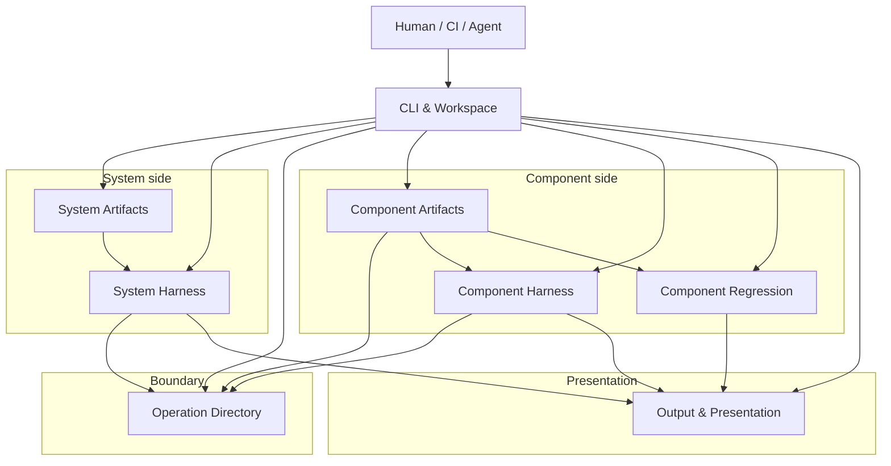
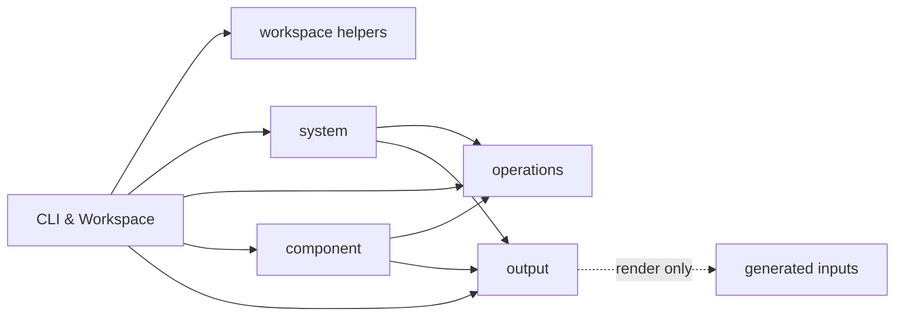
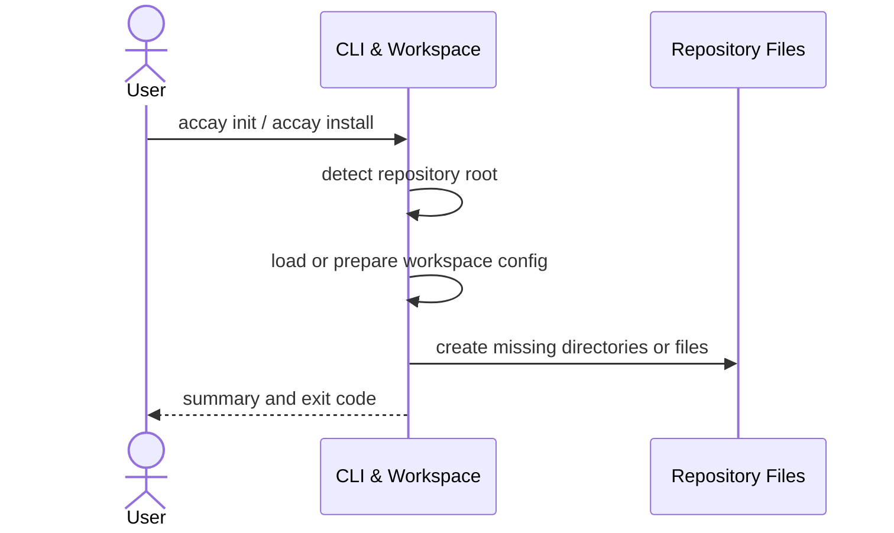
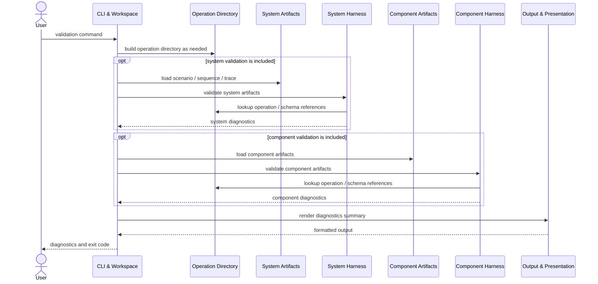
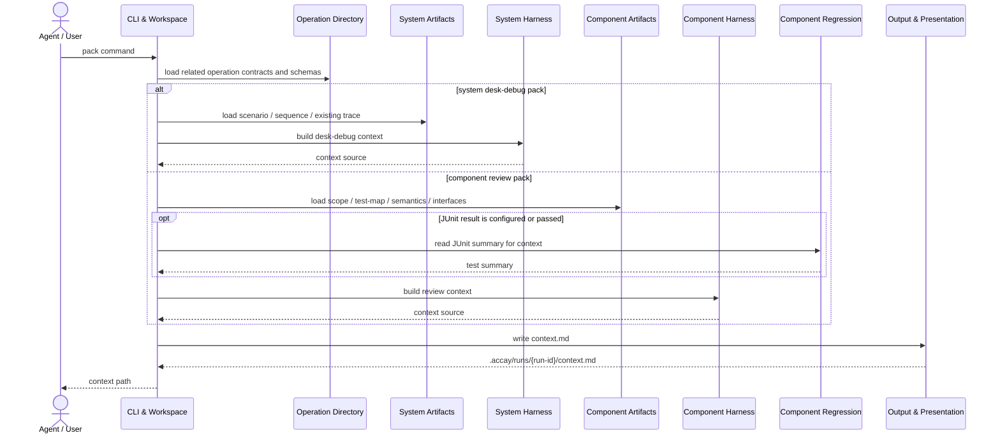
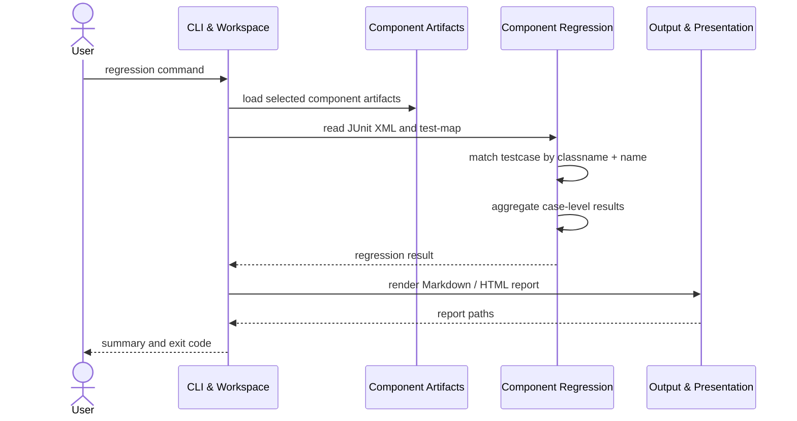
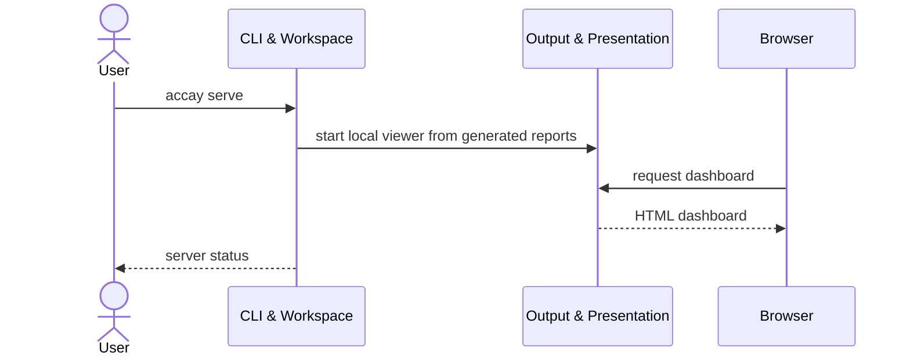

# Accay 基本設計

作成日: 2026-05-24  
対象: Accay MVP  
参照: [requirements.md](requirements.md)

## 1. この文書の位置づけ

この文書は、Accay MVP の実装を進めるための基本設計である。

この文書で固定するのは、実装前に揺らしたくない境界である。

- コンポーネント分割
- コンポーネントごとの責務
- コンポーネント間の依存方向
- パッケージ構成の目安
- 代表的な処理シーケンス
- Accay 自身のテスト構成の最小方針

一方で、実装中に調整してよい詳細はここでは固定しない。

- 内部データモデル
- クラス設計
- 関数シグネチャ
- parser / validator の細かい実装方式
- report / context の詳細テンプレート
- dashboard の具体 UI
- 詳細なテストケース一覧
- fixture project の個別内容
- golden file 比較や pytest marker の詳細ルール

Accay のハーネスは、最終的な受け入れ判断を行わない。ハーネスの役割は、エージェントと人間が判断できるように、入力、構造、照合結果、レポートを安定して揃えることである。

## 2. 設計方針

| 方針 | 内容 |
|---|---|
| system と component を分ける | system は業務シナリオと operation 列を扱う。component は責務、契約、受け入れケース、テスト証拠を扱う。 |
| 接続点を Operation Directory に寄せる | system と component は互いの成果物を直接の正本として読まない。`component + operation` の契約参照を境界にする。 |
| 判断と機械処理を分ける | ハーネスは形式検証、schema validation、JUnit 照合、report / context 生成を行う。意味判断と最終判断は人間とエージェントに残す。 |
| 長期保守成果物と一時成果物を分ける | `docs/acceptance/` は人間も読む正本、`.accay/` は設定・生成物・一時成果物とする。 |
| 外部形式を境界で扱う | OpenAPI、operations.yaml、JSON Schema、JUnit XML は、それぞれ専用の読み取り箇所を持つ。 |
| MVP では静的に扱う | PR 投稿、自動修正、test-map 自動更新、言語別静的解析、エージェント実行は行わない。 |

## 3. 全体構成

Accay MVP は、以下の 8 コンポーネントで構成する。

大きく見ると、構成は4つの領域に分かれる。

- `shared`: CLI、workspace、表示など、system / component の両方から使う領域
- `system`: システム全体の業務シナリオと trace を扱う領域
- `boundary`: system と component の唯一の機械的な接続点
- `component`: 個別コンポーネントの責務、契約、受け入れケース、証拠を扱う領域



この図は論理構成を示す。実装上、同じ Python module 内で補助関数を共有してもよい。ただし、system と component の直接依存を作らないことを優先する。

接続の要点は次の通りである。

- system 側は component の `acceptance-scope.yaml` や `test-map.yaml` を直接読まない。
- component 側は system trace を正本として要求しない。
- 両者の接点は `Operation Directory` が提供する `component + operation` の契約情報に限定する。

## 4. コンポーネント責務

### 4.1 責務一覧

各コンポーネントの責務と非責務は以下の通りである。非責務を明示することで、実装時に境界がにじまないようにする。

| コンポーネント | 領域 | 主な責務 | 主な非責務 |
|---|---|---|---|
| CLI & Workspace | shared | コマンドライン引数の解釈、repository root の特定、`.accay/config.yaml` の読み取り、各処理の起動、`init` / `install` の実行 | 各成果物の深い検証、JUnit 照合、意味判断 |
| System Artifacts | system | `scenario.feature`、`sequence.md`、`trace.yaml` の発見・読み取り・基本的な構造化 | component の `acceptance-scope.yaml` / `test-map.yaml` の読み取り |
| System Harness | system | system validation、desk-debug context pack 生成、trace からの operation / schema 参照確認 | component の受け入れケース判定、JUnit 照合、最終的な意味判断 |
| Operation Directory | boundary | component interfaces から operation contract と schema 参照を引けるようにする | `semantics.md` の意味判断、acceptance case の状態管理、test-map 照合 |
| Component Artifacts | component | `acceptance-scope.yaml`、`test-map.yaml`、`semantics.md`、`interfaces/*` の発見・読み取り | system trace を正本として読むこと、JUnit XML の集計 |
| Component Harness | component | component validation、acceptance review context pack 生成、scope / test-map / interfaces の整合性確認 | regression 判定、最終 accept / reject 判断、test-map の自動更新 |
| Component Regression | component | JUnit XML と `test-map.yaml` の照合、case 単位の回帰結果集計 | 失敗原因の意味解釈、修正案作成、system trace の読み取り |
| Output & Presentation | shared | diagnostics、context、regression result を Markdown / HTML / dashboard に整形する | 正本成果物の更新、validation / regression の実ロジック |

### 4.2 責務境界の考え方

#### System side

System side は、E2E に近い業務シナリオの流れを扱う領域である。主語は「システム全体のシナリオ」であり、個別コンポーネントの受け入れ判断ではない。

正本として読む成果物は主に以下である。

```text
docs/acceptance/scenarios/
docs/acceptance/sequences/
docs/acceptance/traces/
```

System side が component 側に対して知ってよいのは、`component + operation` で参照できる契約情報だけである。これにより、trace は operation 列を検証できるが、component の受け入れ台帳には依存しない。

System side は、以下をしない。

- component の acceptance case ID を必須参照にする
- `test-map.yaml` を読む
- JUnit XML を読む
- component regression の結果を正本として扱う

#### Component side

Component side は、個別コンポーネントの責務、契約、受け入れケース、テスト証拠を扱う領域である。主語は「その component を受け入れてよいか」であり、システム全体のシナリオ実行ではない。

正本として読む成果物は主に以下である。

```text
docs/acceptance/components/{component}/
  acceptance-scope.yaml
  test-map.yaml
  semantics.md
  review-guidelines.md
  interfaces/
```

Component side は、system trace を必須入力にしない。component validation と component regression は、component 配下の成果物だけで最低限回る必要がある。

ただし、`component pack review` では、レビュー文脈を豊かにするために関連 trace / scenario / sequence を参考情報として含めてもよい。この場合も、component validation / component regression の正本にはしない。

#### Boundary

Operation Directory は、system と component の機械的な接続点である。ここに集約するのは、意味判断ではなく、operation contract の参照である。

主な役割は以下である。

- `component + operation` の存在確認
- operation kind の参照
- input / output schema 参照の解決
- HTTP status code の参照
- CLI exit code の参照
- OpenAPI / operations.yaml の operation ID 重複検出

Operation Directory は、意味論の正本ではない。意味論の正本は `semantics.md` である。

#### Output

Output & Presentation は、表示とファイル出力だけを扱う。各領域の結果を読みやすく整形するが、validation や regression の判断ロジックは持たない。

- Markdown report
- HTML report
- context pack
- local dashboard

Output は system / component の結果を並べて表示してよい。ただし、表示の都合で system と component の正本を混ぜない。

## 5. 依存関係

### 5.1 許可する依存方向

依存方向は、CLI から各領域へ流し、system / component は Operation Directory と Output だけを共有する形にする。



基本の依存方向は以下とする。

```text
cli -> workspace
cli -> system
cli -> operations
cli -> component
cli -> output

system -> operations
system -> output

component -> operations
component -> output
```

### 5.2 禁止する依存方向

以下の直接依存は持たない。特に、system と component が互いの artifact loader を呼び合わないようにする。

```text
system -> component
component -> system
operations -> system
operations -> component
output -> system artifact loaders
output -> component artifact loaders
```

特に、次の2つは守る。

- system validation は component の acceptance-scope / test-map に依存しない
- component regression は system trace に依存しない

### 5.3 CLI の位置づけ

CLI は orchestration layer とする。CLI は処理の順序を決めるが、検証や照合の本体は持たない。

CLI は複数コンポーネントを順に呼んでよい。たとえば `accay validate` では、Operation Directory を作ってから system validation と component validation を呼び、最後に Output でまとめる。

ただし、CLI 自体に validation / regression の本体ロジックを置かない。

### 5.4 Output の位置づけ

Output は表示用の集約を行ってよい。

ただし、Output が system / component の正本ファイルを直接読んで判断しない。Output は、各 harness / regression から渡された結果を Markdown / HTML / dashboard に整形する。

`accay serve` は、原則として生成済み report を表示する薄い viewer とする。

## 6. 推奨パッケージ構成

この構成は実装開始時の目安である。細かいファイル分割は実装中に変えてよいが、`system` と `component` の直接依存を避ける package 境界は維持する。

```text
src/accay/
  cli.py

  workspace/
    config.py
    init.py
    skills.py

  system/
    artifacts.py
    validate.py
    pack.py

  operations/
    directory.py
    openapi.py
    native.py
    schemas.py

  component/
    artifacts.py
    validate.py
    review_pack.py
    regression.py
    junit.py

  output/
    diagnostics.py
    context.py
    reports.py
    server.py

  templates/
    skills/
```

### 6.1 package ごとの役割

| package | 役割 |
|---|---|
| `workspace` | config、repository root、初期化、skill install を扱う |
| `system` | scenario / sequence / trace の読み取り、system validation、desk-debug context 生成を扱う |
| `operations` | OpenAPI / operations.yaml / schemas を operation contract として参照可能にする |
| `component` | acceptance-scope / test-map / semantics / interfaces、review context、JUnit regression を扱う |
| `output` | diagnostics、context、report、dashboard 表示を扱う |
| `templates` | skill template や生成用テンプレートを置く |

### 6.2 実装上の余白

この文書では `models.py` や class diagram を固定しない。

実装上、内部型や dataclass が必要なら各 package の内側で定義してよい。ただし、それらを architecture の公開契約にはしない。

## 7. テスト構成

Accay 自身のテストについて、この基本設計では最小限の分類だけを決める。詳細なテストケース、fixture project の中身、pytest marker、golden file の比較ルールは、別のテストガイドラインで定義する。

### 7.1 テスト分類

| 分類 | 位置づけ | CI での扱い | 主な対象 |
|---|---|---|---|
| Contract Test | Accay の公開振る舞いを固定する長期保守テスト。受け入れテストはこの中核に含める。 | 必須 | CLI 挙動、exit code、生成ファイル、diagnostics、report / context の主要構造、ACCAY 受け入れ条件 |
| Unit Test | 内部処理の局所的な正しさを確認する補助テスト。 | 必須 | parser、resolver、matcher、formatter など |
| Probe Test | 調査・観測・再現実験のための一時テスト。 | 通常 CI から除外 | OpenAPI / JUnit XML の edge case 観察、実装中の仮説検証 |

Contract Test は、ユーザーリポジトリに対して Accay CLI がどう振る舞うかを中心に置く。内部実装の形ではなく、公開された振る舞いを固定する。

受け入れテストは、要件定義の受け入れ条件に直接対応する Contract Test として扱う。
一方で Contract Test には、明示的な受け入れ条件に含まれない公開挙動も含めてよい。

### 7.2 推奨テストディレクトリ

```text
tests/
  contract/
  unit/
  probe/
  fixtures/
  golden/
```

| ディレクトリ | 役割 |
|---|---|
| `tests/contract/` | CLI と fixture project を使い、Accay の公開振る舞いを検証する |
| `tests/unit/` | parser / resolver / matcher などの局所処理を検証する |
| `tests/probe/` | 調査・観測用の一時テストを置く |
| `tests/fixtures/` | 小さな疑似リポジトリ、JUnit XML、schema などを置く |
| `tests/golden/` | report / context の主要構造を比較するための期待ファイルを置く |

### 7.3 テスト方針

Accay はユーザーリポジトリに導入される CLI ツールである。
そのため、テストの中心は内部関数ではなく、小さな fixture project に対する CLI の振る舞いに置く。

基本方針は以下とする。

- Contract Test を最重要の長期保守テストにする
- Unit Test は複雑な局所処理を補助的に支える
- Probe Test は通常 CI の対象にしない
- golden file は report / context の主要構造確認に限定する
- run id、timestamp、絶対パスなどの揺れやすい値の扱いはテストガイドラインで定義する

## 8. 代表シーケンス

ここでは、コマンドごとに個別シーケンスを並べず、処理トポロジーが同じものをまとめて説明する。読み手は「どの部品がどの順に動くか」をここで把握し、個別コマンドの細部は CLI 実装側で確認する。

| トポロジー | 対象コマンド |
|---|---|
| Workspace mutation | `accay init`, `accay install` |
| Validation | `accay validate`, `accay system validate`, `accay component validate <component>` |
| Context pack generation | `accay system pack desk-debug --scenario <scenario>`, `accay component pack review <component> --case <case-id>` |
| Regression | `accay regression --junit <path>`, `accay component regression <component> --junit <path>` |
| Serve | `accay serve` |

### 8.1 Workspace mutation

対象コマンド:

```bash
accay init
accay install
```



このトポロジーの目的は、Accay を導入できる workspace を準備することである。既存ファイルは不用意に上書きしない。

- `init` は標準ディレクトリと default config を準備する
- `install` は設定された skill install dir に `accay-*` skill を配置する

### 8.2 Validation

対象コマンド:

```bash
accay validate
accay system validate
accay component validate <component>
```



Validation の流れは、Operation Directory を必要に応じて作り、system validation と component validation を対象範囲に応じて実行する。コマンドごとの差は、どちらの validation を実行するかである。

| コマンド | system validation | component validation |
|---|---:|---:|
| `accay validate` | する | 全 component に対してする |
| `accay system validate` | する | しない |
| `accay component validate <component>` | しない | 指定 component に対してする |

### 8.3 Context pack generation

対象コマンド:

```bash
accay system pack desk-debug --scenario <scenario>
accay component pack review <component> --case <case-id>
```



system desk-debug pack と component review pack は、どちらも「必要な正本成果物を集めて、エージェント / 人間向けの `context.md` を生成する」処理である。

違いは、正本として読む成果物である。相手側の情報を含める場合も、あくまで参考情報として扱う。

| コマンド | 正本として読むもの | 参考情報として読めるもの |
|---|---|---|
| `system pack desk-debug` | scenario / sequence / trace | component semantics / operation contract |
| `component pack review` | scope / test-map / semantics / interfaces | 関連 trace / scenario / sequence、JUnit summary |

### 8.4 Regression

対象コマンド:

```bash
accay regression --junit <path>
accay component regression <component> --junit <path>
```



Regression は component 側の処理である。違いは対象 component の範囲だけで、system trace は直接読まない。

| コマンド | 対象 |
|---|---|
| `accay regression --junit <path>` | 全 component |
| `accay component regression <component> --junit <path>` | 指定 component |

component regression は system trace を直接読まない。

### 8.5 Serve

対象コマンド:

```bash
accay serve
```



`serve` は生成済み report を見るための薄い viewer とする。

MVP では、正本成果物の編集、test-map の承認 UI、proposal の適用 UI は持たない。

## 9. Validation / Regression / Pack の配置

各処理の置き場所は、正本として読む成果物の所有者に合わせる。

| 処理 | 置き場所 | 理由 |
|---|---|---|
| system validation | `system` | scenario / sequence / trace を対象にするため |
| component validation | `component` | scope / test-map / semantics / interfaces を対象にするため |
| operation lookup / schema lookup | `operations` | system と component の共通境界にするため |
| JUnit XML 照合 | `component` | test-map は component 正本であり、system trace とは独立して回すため |
| context pack の整形 | `output` | Markdown 出力は表示責務に寄せるため |
| context pack の材料選定 | `system` / `component` | 何を文脈に含めるかは対象領域ごとに違うため |
| report / dashboard | `output` | 表示責務としてまとめるため |

## 10. MVP で明示的に扱わないもの

以下は MVP の基本設計では扱わない。後続フェーズで必要性が出た場合に、改めて設計する。

- エージェント実行そのもの
- PR コメント投稿
- コード自動修正
- `test-map.yaml` の完全自動更新
- 独自 patch DSL
- OpenAPI の高度な差分解析
- trace からのテスト自動生成
- Smithy / AsyncAPI / Protobuf / gRPC adapter
- `message` / `job` / `file` kind
- function の実コード存在確認
- 言語別静的解析
- dashboard 上での正本編集

## 11. 実装時の判断余地

この基本設計は、実装を進めるための境界を決める文書である。

以下は、実装フェーズで判断してよい。

- 内部型を dataclass にするか dict ベースにするか
- parser と validator を同じ module に置くか分けるか
- diagnostics の具体フィールド
- report の詳細レイアウト
- context.md の詳細テンプレート
- HTML dashboard を静的生成中心にするか、local server 側で組み立てるか
- package 内部の helper module 分割

ただし、以下は実装フェーズでも崩さない。

- system と component の直接依存を作らない
- system validation は component acceptance-scope / test-map を正本として読まない
- component regression は system trace を正本として読まない
- operation contract 参照は Operation Directory に寄せる
- Output & Presentation に validation / regression の本体ロジックを置かない
