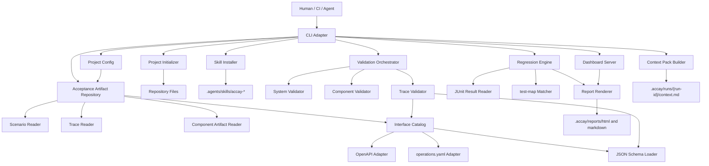
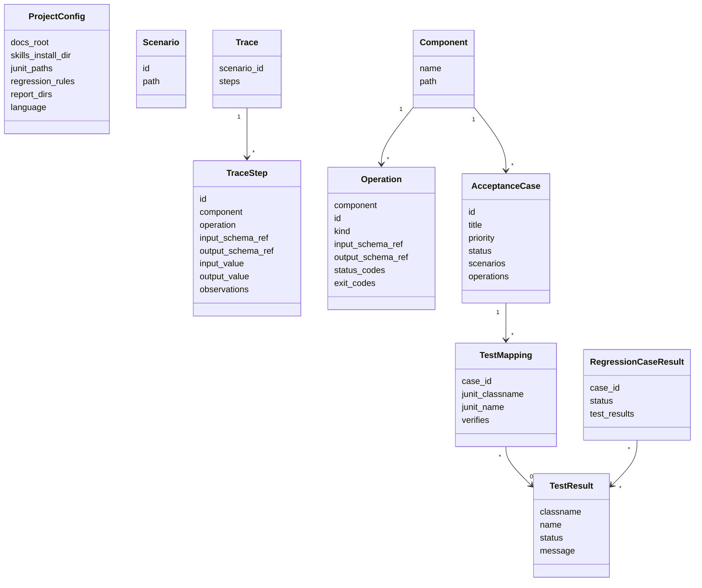
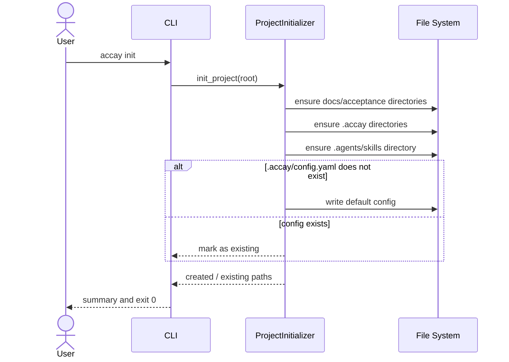
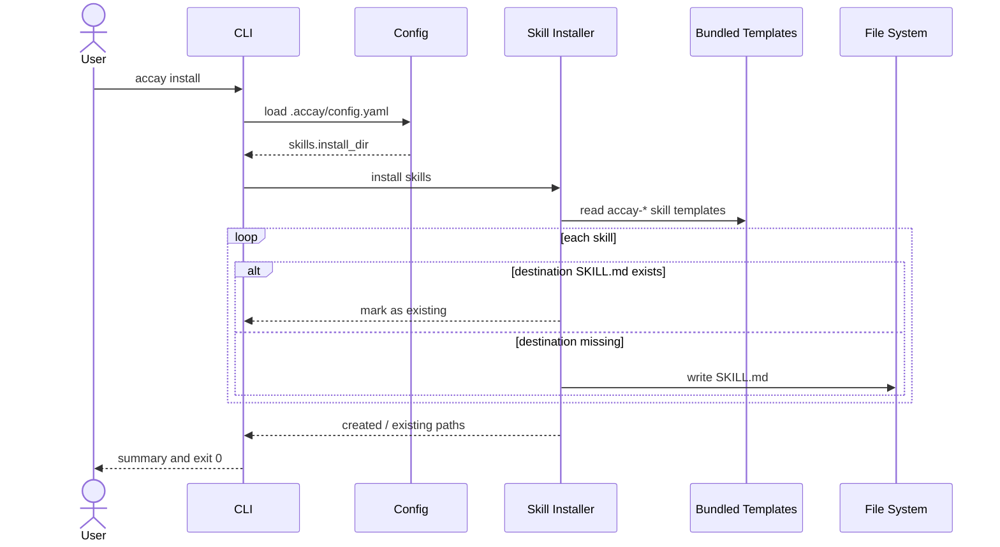
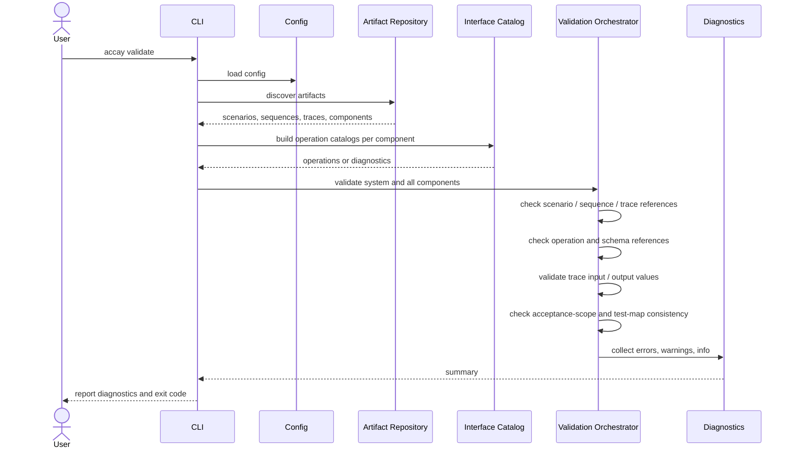
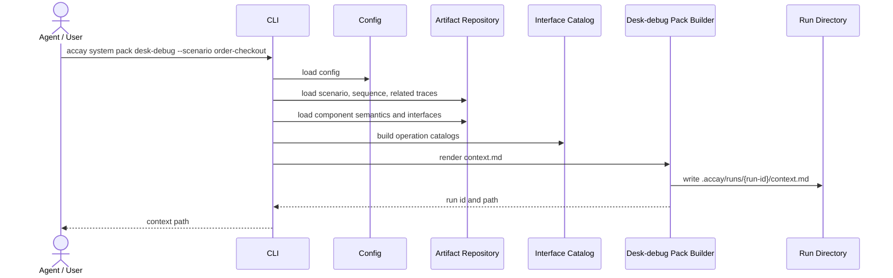
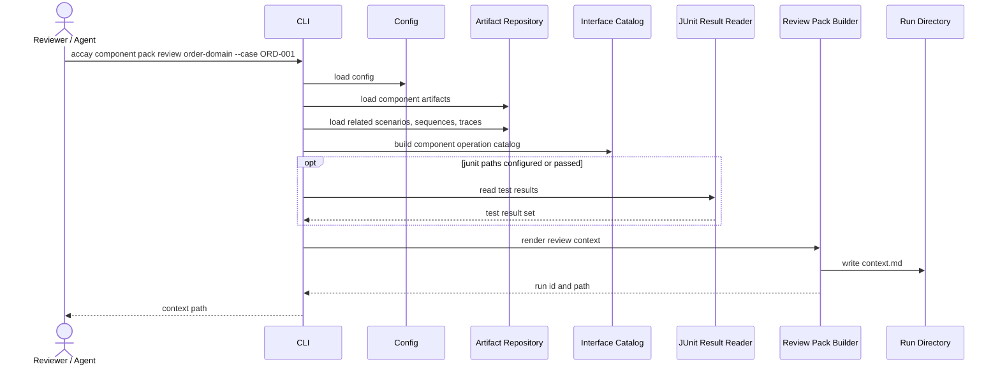
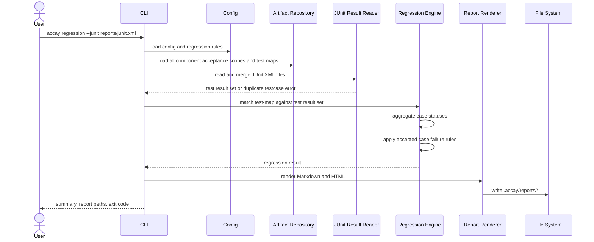
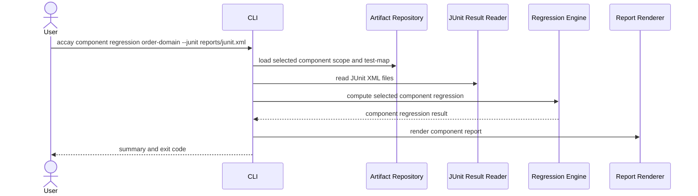
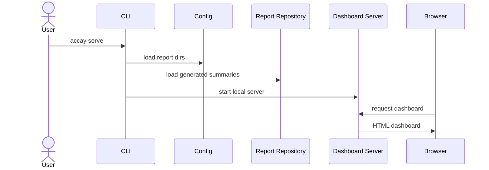

# Accay 基本設計

作成日: 2026-05-24
対象: Accay MVP
参照: [requirements.md](requirements.md)

## 1. 設計目的

この文書は、Accay MVP の実装を進めるための基本設計である。

Accay は、AI コーディングエージェントが生成した変更を、テスト結果だけではなく、意味・証拠・責務境界に基づいて受け入れ可能か確認するためのツールである。MVP のハーネスは最終判断を行わず、判断に必要な入力、構造、照合結果、レポートを安定して揃える。

## 2. 設計方針

| 方針 | 内容 |
|---|---|
| 判断と機械処理を分離する | ハーネスは形式検証、schema validation、JUnit 照合、レポート生成に徹する。意味判断と最終受け入れ判断は人間とエージェントに残す。 |
| operation を中心に扱う | endpoint や関数名ではなく、`component + operation` を内部モデルの基本単位にする。 |
| 長期保守成果物を優先する | 人間が読む仕様、trace、scope、test-map は `docs/acceptance/` 以下を正本にする。 |
| 一時成果物を隔離する | context pack、review decision、生成レポートは `.accay/` 以下に置き、長期保守成果物と混ぜない。 |
| adapter 境界を明確にする | OpenAPI や JUnit XML など外部形式は、内部モデルへ変換してから後続処理に渡す。 |
| MVP では静的に扱う | PR 投稿、自動修正、test-map 自動更新、言語別静的解析は行わない。 |

## 3. 全体構成



## 4. 内部コンポーネント責務

| コンポーネント | 主な責務 | 読むもの | 書くもの |
|---|---|---|---|
| CLI Adapter | コマンドライン引数を解釈し、ユースケースに処理を委譲する。終了コードと標準出力の方針を統一する。 | CLI args | stdout / stderr / exit code |
| Project Config | `.accay/config.yaml` を読み、docs root、skills install dir、JUnit path、regression rule、report dir、language 設定を提供する。 | `.accay/config.yaml` | なし |
| Project Initializer | `accay init` で標準ディレクトリと初期 config を作る。既存ファイルは上書きしない。 | repository root | `.accay/config.yaml`, `docs/acceptance/`, `.accay/`, `.agents/skills/` |
| Skill Installer | bundled skill template を設定された skill directory に配置する。既存 skill は上書きしない。 | package templates, config | `.agents/skills/accay-*` |
| Acceptance Artifact Repository | `docs/acceptance/` 以下の成果物を発見し、後続処理が扱いやすい単位で返す。 | scenarios, sequences, traces, components | なし |
| Interface Catalog | component ごとの operation catalog を作る。OpenAPI と `operations.yaml` を統合し、重複 operation ID を検出する。 | `openapi.yaml`, `operations.yaml` | in-memory operation catalog |
| OpenAPI Adapter | OpenAPI から `operationId`、schema 参照、HTTP status code を読み、HTTP operation として正規化する。 | `openapi.yaml` | in-memory operations |
| operations.yaml Adapter | Accay native operation 定義を読み、`http` / `cli` / `function` operation として正規化する。 | `operations.yaml` | in-memory operations |
| JSON Schema Loader | schema file を読み込み、trace `input.value` / `output.value` の validation に使う。 | `*.schema.json` | compiled schema cache |
| System Validator | scenario、sequence、trace、component、operation、schema の参照整合性を検証する。 | system artifacts | diagnostics |
| Component Validator | `acceptance-scope.yaml` と `test-map.yaml` の構文、case 参照、`verifies` の必須性を検証する。 | component artifacts | diagnostics |
| Trace Validator | trace step の重複、operation 参照、schema validation、HTTP status、CLI exit code、observation の最低限チェックを行う。 | trace, operation catalog, schemas | diagnostics |
| JUnit Result Reader | 1つ以上の JUnit XML を読み、`classname + name` をキーにした test result set へ変換する。重複 testcase は error にする。 | JUnit XML | in-memory test result set |
| Regression Engine | `test-map.yaml` と JUnit result set を照合し、case 単位の pass / fail / error / skipped / missing を集計する。 | acceptance scope, test-map, JUnit result set | regression result |
| Context Pack Builder | エージェントに渡す Markdown context を生成する。system desk-debug と component review の2系統を扱う。 | related artifacts, diff, tests | `.accay/runs/{run-id}/context.md` |
| Report Renderer | regression result や review result を Markdown / HTML に整形する。 | result models | `.accay/reports/markdown`, `.accay/reports/html` |
| Dashboard Server | `accay serve` で HTML report を表示する。MVP では生成済み report を読む薄い viewer とする。 | report files, summary model | local HTTP response |
| Diagnostics | error / warning / info を収集し、CLI exit code と report 表示に渡す共通モデルを提供する。 | component outputs | diagnostics summary |

## 5. データモデル

MVP の内部モデルは、外部 YAML / JSON / XML をそのまま広げず、以下の概念に正規化して扱う。



## 6. 推奨パッケージ構成

現在の実装は `cli.py` と `project.py` の最小骨格から始めている。MVP 実装では、以下のように責務単位で module を分ける。

```text
src/accay/
  cli.py
  config.py
  diagnostics.py
  project.py

  artifacts/
    repository.py
    scenario.py
    trace.py
    component.py

  interfaces/
    catalog.py
    openapi_adapter.py
    operations_adapter.py
    schemas.py

  validation/
    orchestrator.py
    system.py
    component.py
    trace.py

  regression/
    junit.py
    engine.py
    model.py

  pack/
    desk_debug.py
    review.py
    runs.py

  reports/
    markdown.py
    html.py
    summary.py

  server/
    app.py

  templates/
    skills/
```

依存方向は `cli -> use case -> artifact / interface / validation / regression / report` とし、低レイヤーから CLI へ依存しない。

## 7. コマンド別シーケンス

### 7.1 `accay init`



`accay init` は既存ファイルを上書きしない。設定変更は後続フェーズで別コマンドまたは手動編集として扱う。

### 7.2 `accay install`



MVP では `--force` は持たない。既存 skill の更新戦略は後続フェーズで扱う。

### 7.3 `accay validate`



終了コードは error があれば非ゼロ、warning / info のみならゼロを基本とする。CI policy の詳細は regression rule と合わせて後続実装で固定する。

### 7.4 `accay system pack desk-debug --scenario <scenario>`



context pack はエージェントが trace 草案を作るための入力であり、trace の正本ではない。

### 7.5 `accay component pack review <component> --case <case-id>`



レビュー結果そのものは `.accay/runs/{run-id}/review-report.md`、`decision.yaml`、`proposed/` に置く。ハーネスは提案ファイルを正本へ自動適用しない。

### 7.6 `accay regression --junit <path>`



accepted case の failed / error / missing / skipped は、デフォルトで fail として扱う。

### 7.7 `accay component regression <component> --junit <path>`



top-level regression と同じ集計ロジックを使い、対象 component のみを絞り込む。

### 7.8 `accay serve`



MVP の dashboard はローカル確認用の薄い viewer とする。大規模な Web UI や編集機能は持たない。

## 8. Validation 設計

Diagnostics は以下の severity を持つ。

| severity | 意味 | 例 |
|---|---|---|
| error | コマンドの目的を達成できない不整合 | operation ID 重複、schema file 不存在、accepted case の mapped test missing |
| warning | 機械的には継続可能だが確認が必要 | trace observation が空、non-accepted case の mapped test failure |
| info | 参考情報 | unmapped test、生成済み report path |

validation の出力は、CLI 表示と Markdown / HTML report の両方で使える共通モデルにする。

## 9. レポート設計

Markdown report はエージェントや CI log で読むことを優先する。HTML report は人間がブラウザで状況を把握することを優先する。

| Report | 主な内容 | 出力先 |
|---|---|---|
| system validation report | scenario / sequence / trace / operation / schema の整合性 | `.accay/reports/markdown`, `.accay/reports/html` |
| component validation report | scope / test-map / semantics / interfaces の整合性 | `.accay/reports/markdown`, `.accay/reports/html` |
| regression report | case status、failed / missing / skipped、unmapped tests | `.accay/reports/markdown`, `.accay/reports/html` |
| review context | 受け入れレビュー用の入力 pack | `.accay/runs/{run-id}/context.md` |
| desk-debug context | 机上デバッグ用の入力 pack | `.accay/runs/{run-id}/context.md` |

## 10. MVP の実装順序

1. Config reader と diagnostics model を追加する。
2. Artifact Repository で `docs/acceptance/` の読み取りを実装する。
3. `operations.yaml` Adapter と JSON Schema Loader を実装する。
4. OpenAPI Adapter を追加し、operation ID 重複検出を実装する。
5. Component Validator と System Validator を実装する。
6. JUnit Result Reader と Regression Engine を実装する。
7. Markdown Report Renderer を実装する。
8. HTML Report Renderer と `accay serve` を実装する。
9. Context Pack Builder を実装する。
10. CLI の planned command を実処理へ差し替える。

## 11. MVP で扱わない境界

- エージェント実行そのもの
- PR コメント投稿
- コード自動修正
- `test-map.yaml` の完全自動更新
- OpenAPI の高度な差分解析
- trace からのテスト生成
- Smithy / AsyncAPI / Protobuf / gRPC adapter
- `message` / `job` / `file` kind
- function の実コード存在確認
- 言語別静的解析
