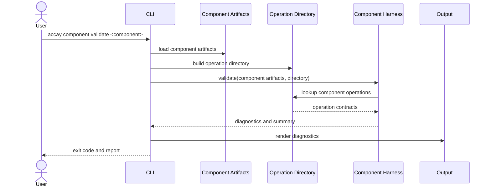
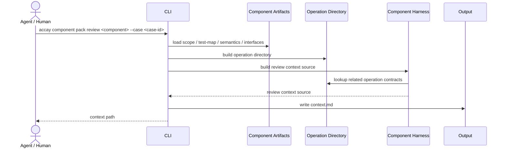

# Component Harness 基本設計
作成日: 2026-05-24  
対象: Accay MVP の Component Harness  
参照: `docs/architecture.md`, `docs/requirements.md`
## 1. 位置づけ
Component Harness は、component side の正本成果物を検証し、受け入れレビュー用 context pack の材料を選定する component である。
対象は、個別 component の責務、契約、受け入れケース、テスト証拠である。
Component Harness は、最終的な accept / reject 判断を行わない。
Component Harness は、JUnit XML と `test-map.yaml` の回帰判定を行わない。
Component Harness は、system trace を正本として要求しない。
system trace / scenario / sequence は、review context の参考情報として含めてもよい。
ただし、それらは component validation の必須入力ではない。
設計上の最重要原則は、system side と component side の正本を混ぜないことである。
## 2. 設計原則
| 原則 | 内容 |
|---|---|
| component 正本中心 | `acceptance-scope.yaml`, `test-map.yaml`, `semantics.md`, `interfaces/*` を中心に扱う |
| Operation Directory 境界 | operation contract は Operation Directory から参照する |
| 意味判断しない | `semantics.md` は読むが、意味の正しさは判定しない |
| 回帰判定しない | JUnit XML 照合は Component Regression に委譲する |
| context は材料 | Markdown の最終整形は Output & Presentation に委譲する |
Component Harness の validation は、受け入れ判断の前提を整える処理である。
validation が成功しても、その変更が意味的に正しいとは限らない。
validation が失敗した場合は、レビューや回帰の前に正本成果物を直す必要がある。
## 3. 対象コマンド
| コマンド | 役割 |
|---|---|
| `accay component validate <component>` | 指定 component の validation を行う |
| `accay validate` | 全 component の validation 部分を担う |
| `accay component pack review <component> --case <case-id>` | review context source を作る |
`accay component regression <component> --junit <path>` は Component Regression の責務である。
ただし、regression 実行前の前提確認として component validation の結果は利用できる。
## 4. 入力
### 4.1 Validation 入力
| 入力 | 必須 | 内容 |
|---|---:|---|
| component name | 必須 | CLI が指定した component 識別子 |
| component artifacts | 必須 | scope / test-map / semantics / interfaces |
| Operation Directory | 必須 | operation contract と schema ref の参照元 |
| workspace config | 任意 | severity policy や context 上限など |
component artifacts の発見と読み取りは Component Artifacts に委譲してよい。
Component Harness は、読み取られた artifact model を受け取って検証する。
### 4.2 Review pack 入力
| 入力 | 必須 | 内容 |
|---|---:|---|
| component name | 必須 | 対象 component |
| case id | 原則必須 | レビュー対象の acceptance case |
| component artifacts | 必須 | scope / test-map / semantics / interfaces |
| Operation Directory | 必須 | operation contract 参照 |
| optional JUnit summary | 任意 | 直近テスト結果の要約 |
| optional reference traces | 任意 | 関連 trace / scenario / sequence |
| optional diff summary | 任意 | 変更差分の要約 |
optional JUnit summary は review context の観測情報である。
optional reference traces は review context の参考情報である。
どちらも component validation の正本ではない。
## 5. 出力
| 出力 | 内容 |
|---|---|
| component diagnostics | validation で検出した error / warning / info |
| validation summary | 対象 artifact、case 数、operation 数など |
| review context source | Output が `context.md` を生成するための材料 |
| source selection notes | 正本情報と参考情報の区別、除外理由 |
Component Harness は構造化された結果を返す。
表示文字列、Markdown、HTML は Output & Presentation が作る。
## 6. 正本成果物
標準配置は以下である。
```text
docs/acceptance/components/{component}/
  acceptance-scope.yaml
  test-map.yaml
  semantics.md
  review-guidelines.md
  interfaces/
    openapi.yaml
    operations.yaml
    schemas/
```
| 成果物 | Component Harness での扱い |
|---|---|
| `acceptance-scope.yaml` | 受け入れケース台帳の正本 |
| `test-map.yaml` | 認定済みテスト証拠台帳の正本 |
| `semantics.md` | component と operation の意味論の正本 |
| `review-guidelines.md` | 任意のレビュー補助資料 |
| `interfaces/*` | Operation Directory へ渡す contract 入力 |
`review-guidelines.md` は任意である。
存在しない場合、validation error にはしない。
## 7. 責務
Component Harness の責務は以下である。
- `accay component validate <component>` の本体処理を担う。
- `accay validate` に含まれる component validation を担う。
- `acceptance-scope.yaml` の構文と基本項目を検証する。
- `test-map.yaml` の構文と case 参照を検証する。
- `test-map.yaml` の `verifies` が 1 件以上あることを確認する。
- component interfaces を Operation Directory と照合する。
- operation contract の schema ref が解決できるか確認する。
- `semantics.md` を review context の意味論材料として選定する。
- acceptance review context pack の source を構成する。
- optional reference traces の採否と扱いを明示する。
- diagnostics を severity 付きで返す。
## 8. 非責務
Component Harness は以下を行わない。
- JUnit XML と `test-map.yaml` の回帰判定。
- case 単位の pass / fail / error / skipped / missing 集計。
- 最終 accept / reject 判断。
- `test-map.yaml` の自動更新。
- `acceptance-scope.yaml` の自動更新。
- review context Markdown の最終整形。
- system trace を必須入力とする検証。
- system scenario の意味判断。
- `semantics.md` の意味的正しさの完全判定。
- function kind の実コード存在確認。
- 言語別静的解析。
- OpenAPI lint としての詳細診断。
- PR コメント投稿。
- エージェント実行。
特に、テストが通っていることをもって Harness が受け入れ済み判断をしてはならない。
## 9. acceptance-scope.yaml 検証
`acceptance-scope.yaml` では、少なくとも以下を確認する。
- YAML として読めること。
- top-level structure が期待形式であること。
- case ID が存在すること。
- case ID が component 内で重複しないこと。
- case status が許可値であること。
- operation 参照がある場合、Operation Directory で解決できること。
- scenario / trace 参照がある場合、review context では参考情報として扱うこと。
MVP の許可 status は以下とする。
| status | 意味 |
|---|---|
| `draft` | 草案 |
| `ready` | 実装・レビュー対象として準備済み |
| `accepted` | 受け入れ済み |
| `blocked` | ブロック中 |
| `deprecated` | 廃止 |
`implemented` や `reviewed` は、MVP の scope status として扱わない。
これらが現れた場合は、既定では error とする。
互換性が必要な場合は、設定で warning に落とせる余地を残す。
## 10. test-map.yaml 検証
`test-map.yaml` では、少なくとも以下を確認する。
- YAML として読めること。
- `mappings` が存在すること。
- `mappings` が辞書形式であること。
- 各 mapping が case ID を参照していること。
- 参照された case ID が `acceptance-scope.yaml` に存在すること。
- JUnit testcase の `classname` が空でないこと。
- JUnit testcase の `name` が空でないこと。
- `verifies` が存在すること。
- `verifies` が 1 件以上であること。
- `verifies` の各要素が空文字でないこと。
Component Harness は、JUnit XML に testcase が実在するかは確認しない。
JUnit XML との照合は Component Regression が行う。
同じ `classname + name` が複数 mapping から参照される場合、既定では warning とする。
将来、同一 testcase が複数 case を検証する運用を正式に許容する場合は、この severity を調整する。
## 11. scope / test-map 対応チェック
scope と test-map の対応関係は、Component Harness の中心的な検証対象である。
基本ルールは以下である。
- `test-map.yaml` から参照される case ID は scope に存在しなければならない。
- `accepted` case に test-map mapping がない場合は warning とする。
- `deprecated` case に test-map mapping が残っている場合は warning とする。
- `blocked` case に test-map mapping があっても error にはしない。
- `draft` case に test-map mapping があっても error にはしない。
`accepted` case の mapping 不足を error にするかは CI policy で調整可能にする。
MVP の既定は warning とする。
理由は、受け入れレビューと証拠登録の移行期間を許容するためである。
## 12. interfaces 検証
interfaces は Operation Directory を通して検証する。
Component Harness は、対象 component の operation catalog を Operation Directory から引く。
検証項目は以下である。
- 対象 component が Operation Directory に存在すること。
- 同一 component 内の operation ID が重複しないこと。
- operation kind が MVP の対応範囲であること。
- input schema ref が解決できること。
- output schema ref が解決できること。
- `http` operation の status code が参照可能であること。
- `cli` operation の exit code が参照可能であること。
MVP の operation kind は `http`, `cli`, `function` である。
`message`, `job`, `file`, `grpc`, `asyncapi` は後続フェーズの拡張対象である。
未知の kind は既定で error とする。
OpenAPI の詳細な lint は Operation Directory 側の責務である。
Component Harness は、component artifact と operation contract の対応関係だけを見る。
## 13. semantics.md の扱い
`semantics.md` は意味論の正本である。
Component Harness は、以下の軽い確認だけを行う。
- ファイルが存在すること。
- ファイルが読み取れること。
- 空でないこと。
- review context source に含められること。
MVP では、見出し構造や operation ごとの記載漏れを厳密には検証しない。
ただし、Operation Directory に存在する operation ID が本文に一度も現れない場合は warning としてよい。
この warning は意味判断ではなく、レビュー材料の不足を知らせるためのものである。
## 14. Operation Directory interactions
Component Harness は、validation と review context source 生成の両方で Operation Directory を利用する。
CLI は、必要に応じて先に Operation Directory を構築し、Component Harness に渡す。
Component Harness は、Operation Directory の構築手順を内包しない。
参照する情報は以下である。
- component の存在。
- operation ID の一覧。
- operation kind。
- input schema ref。
- output schema ref。
- HTTP status code。
- CLI exit code。
- schema ref の解決結果。
- OpenAPI 由来か `operations.yaml` 由来かの source hint。
source hint は diagnostics や context notes に使える。
source hint を意味判断に使ってはならない。
Operation Directory が operation を解決できない場合、Component Harness は error diagnostic を返す。
schema ref が解決できない場合も error とする。
## 15. Review context source
review context source は、人間またはエージェントが受け入れレビューを行うための材料である。
対象の問いは次である。
```text
この変更を、この component の受け入れケースとして受け入れてよいか。
```
Component Harness は、この問いに答えやすい順序で情報を選定する。
最終的な文章化は Output & Presentation が行う。
### 15.1 Source 区分
| 区分 | 内容 |
|---|---|
| `primary` | component side の正本成果物 |
| `contract` | Operation Directory から引いた operation contract |
| `evidence` | 既存 `test-map.yaml` と optional JUnit summary |
| `reference` | 関連 trace / scenario / sequence |
| `notes` | 選定理由、除外理由、diagnostics |
`primary` と `contract` はレビューの中心材料である。
`reference` は文脈理解の補助であり、component validation の正本ではない。
### 15.2 必ず含める材料
review context source には、原則として以下を含める。
- 対象 component 名。
- 対象 case ID。
- 対象 case の scope entry。
- 対象 case と同じ operation を参照する case の要約。
- 対象 component の関連 test-map mapping。
- `semantics.md` の全文または関連抜粋。
- 対象 operation の contract。
- input / output schema ref の要約。
- validation diagnostics の要約。
対象 case ID が scope に存在しない場合、context source は生成失敗としてよい。
この場合は error diagnostic を返す。
### 15.3 必要に応じて含める材料
以下は存在する場合に含める。
- `review-guidelines.md`。
- optional JUnit summary。
- optional diff summary。
- 対象 operation に関連する trace。
- 対象 case に関連する scenario。
- 対象 scenario に関連する sequence。
- 直近 review report へのパス。
optional JUnit summary は、現在の test-map に対する回帰判定ではない。
fail / missing / skipped の意味解釈は reviewer または Component Regression に委ねる。
### 15.4 optional reference traces
reference traces は、次の順で選定する。
1. scope entry が scenario または trace を明示参照しているもの。
2. scope entry が operation を参照し、その operation を含む trace。
3. 対象 component の operation を含む trace。
4. CLI から明示指定された trace。
選定数は上限を設ける。
MVP の推奨上限は 5 件である。
上限を超えた場合は、除外件数と理由を notes に残す。
reference traces は `primary` に入れない。
### 15.5 既定で除外する材料
以下は既定では context source に含めない。
- component と関係しない全 trace。
- 全 JUnit XML の生データ。
- 大きな OpenAPI 全文。
- 大きな JSON Schema 全文。
- git diff の全文。
- `.accay/cache/` の内部ファイル。
- Output が生成した過去 HTML の全文。
必要な場合は、要約またはパスだけを渡す。
context は全ファイルのダンプではなく、レビューの入力である。
## 16. Diagnostics
diagnostics severity は、最低限以下を持つ。
| severity | 意味 |
|---|---|
| `error` | 機械処理を継続できない、または正本整合性が壊れている |
| `warning` | 処理は継続できるが、レビューや運用上の注意が必要 |
| `info` | 参考情報、選定理由、補足 |
MVP では `fatal` を分けない。
予期しない例外は CLI 層で error diagnostic に変換する。
### 16.1 Error 例
- `acceptance-scope.yaml` が読めない。
- `test-map.yaml` が読めない。
- case ID が重複している。
- case status が許可値ではない。
- `test-map.yaml` の case ID が scope に存在しない。
- `verifies` が空である。
- 対象 component が Operation Directory に存在しない。
- operation ID が重複している。
- operation の schema ref が解決できない。
- review pack の対象 case が存在しない。
### 16.2 Warning 例
- `accepted` case に対応する test-map mapping がない。
- `deprecated` case に test-map mapping が残っている。
- `semantics.md` に operation ID が見つからない。
- `review-guidelines.md` が存在しない。
- optional reference traces が多すぎて一部除外された。
- 同じ JUnit testcase が複数 mapping から参照されている。
warning は、exit code を失敗にするかどうかを policy で調整可能にしてよい。
MVP の既定では warning のみなら validate は成功扱いとする。
### 16.3 Info 例
- review context に含めた primary source の一覧。
- reference trace を選定した理由。
- JUnit summary が渡されなかったこと。
- optional diff summary が渡されなかったこと。
- context source から大きな schema 本文を除外したこと。
### 16.4 推奨フィールド
| フィールド | 内容 |
|---|---|
| `severity` | `error` / `warning` / `info` |
| `code` | 安定した診断コード |
| `message` | 人間向け短文 |
| `component` | 対象 component |
| `artifact` | 対象ファイル種別 |
| `path` | 可能ならファイルパス |
| `case_id` | 関連 case ID |
| `operation_id` | 関連 operation ID |
| `hint` | 修正の方向性 |
診断コードは Contract Test で固定しやすいように短く安定させる。
## 17. Processing flow
### 17.1 component validate

処理順序は以下を基本とする。
1. component artifacts を読み取る。
2. Operation Directory を用意する。
3. scope の構文と基本項目を検証する。
4. test-map の構文と case 参照を検証する。
5. interfaces と operation contract を照合する。
6. semantics の存在と読み取りを確認する。
7. scope / test-map / operations の横断チェックを行う。
8. diagnostics と summary を返す。
### 17.2 component pack review

review context source 生成では、validation を先に軽く実行する。
中心材料が欠ける error の場合は生成を止める。
warning のみであれば、diagnostics を context source に含めて生成を継続する。
## 18. Failure modes
### 18.1 Artifact missing
必須 artifact が存在しない場合は error diagnostic を返す。
対象は `acceptance-scope.yaml`, `test-map.yaml`, `semantics.md`, `interfaces/*` である。
interfaces は OpenAPI と `operations.yaml` のどちらか一方だけでもよい。
どちらも存在しない場合は operation contract を作れないため error とする。
### 18.2 Parse failure
YAML の parse failure は error とする。
Markdown は通常 parse しないが、読み取りに失敗した場合は error とする。
可能なら行番号を diagnostic に含める。
### 18.3 Reference mismatch
test-map が存在しない case を参照する場合は error とする。
scope が存在しない operation を参照する場合も error とする。
reference trace が存在しない場合は warning として扱ってよい。
reference trace は正本ではないためである。
### 18.4 Directory unavailable
Operation Directory を構築できない場合、Component Harness は validation を完了できない。
directory がない状態で operation 検証を silently skip してはならない。
CLI は Operation Directory 側と Component Harness 側の diagnostics をまとめて表示する。
### 18.5 Oversized context
context source が大きすぎる場合、全文ではなく要約または path 参照を選ぶ。
大きな schema、OpenAPI、trace は関連部分だけを選ぶ。
除外した情報は info または warning として notes に残す。
### 18.6 Partial optional inputs
optional JUnit summary や optional reference traces が欠けても validation error にはしない。
review context source には、欠けていることを info として残す。
これにより、最小構成の component でも review pack を生成できる。
## 19. Test strategy
### 19.1 Contract Test
Component Harness の主要挙動は Contract Test で固定する。
fixture repository に対して CLI を実行し、diagnostics、exit code、context source の主要構造を確認する。
少なくとも以下を用意する。
- 正常な component が validate pass する。
- scope にない test-map case を error にできる。
- `verifies` 空を error にできる。
- operation contract の schema ref 不整合を error にできる。
- unknown operation kind を error にできる。
- `accepted` case の mapping 不足を warning にできる。
- review context source が component 正本を中心に構成される。
- optional reference trace が reference として扱われる。
- 対象 case が存在しない review pack が error になる。
### 19.2 Unit Test
Unit Test は局所処理を補助する。
対象例は以下である。
- scope parser。
- test-map parser。
- status validator。
- verifies validator。
- case reference resolver。
- source selection scorer。
- diagnostic builder。
- operation contract adapter の薄い wrapper。
Unit Test は内部実装を固定しすぎない。
複雑な分岐や edge case を補う目的で使う。
### 19.3 Golden Test
review context の最終 Markdown は Output & Presentation 側の責務である。
Component Harness 側では context source の主要構造を golden 的に比較してよい。
timestamp、run id、絶対パス、ソート順が揺れる値は正規化する。
golden は「何が含まれるか」を固定し、「Markdown の見た目」を固定しすぎない。
### 19.4 Probe Test
Probe Test は OpenAPI や YAML の edge case を観察するために使う。
通常 CI には含めない。
調査が終わったら Contract Test または Unit Test に落とし込む。
## 20. Implementation notes
architecture の package 方針に合わせ、component package 内に以下を置く想定とする。
```text
accay/
  component/
    artifacts.py
    validate.py
    review_pack.py
    regression.py
    junit.py
```
Component Harness の中心は `validate.py` と `review_pack.py` である。
`regression.py` と `junit.py` は Component Regression の領域である。
内部モデルは実装時に決めてよい。
ただし、artifact model、diagnostics、operation contract、context source、render model は分ける。
出力の安定性のため、case ID、operation ID、diagnostic code、file path、selected reference traces は deterministic に並べる。
scope の case 一覧は、原則としてファイル内の順序を保持する。
path は repository root からの相対パスを基本とする。
内部処理では絶対パスを使ってよい。
外部出力には、ユーザーがリポジトリ内で見つけやすい相対パスを出す。
MVP で設定可能にしてよい項目は以下である。
- warning を exit code failure にするか。
- `accepted` case の mapping 不足を warning にするか error にするか。
- review context に含める reference trace の上限。
- `verifies` の記述言語。
- context source に schema 本文を含める最大サイズ。
## 21. 受け入れ条件との対応
| ID | Component Harness での対応 |
|---|---|
| ACCAY-003 | Operation Directory を通じて operation を参照する |
| ACCAY-004 | 同一 component 内 operation ID 重複を validate error にする |
| ACCAY-006 | test-map の case ID が scope に存在するか確認する |
| ACCAY-007 | test-map の `verifies` が 1 件以上あることを確認する |
| ACCAY-012 | component review context pack の source を生成する |
ACCAY-008 から ACCAY-011 は Component Regression の主担当である。
Component Harness は、それらの前提となる `test-map.yaml` の構造確認だけを担う。
## 22. 将来拡張
後続フェーズでは、以下を拡張できる。
- `message` / `job` / `file` / `grpc` / `asyncapi` kind。
- operation ごとの semantics coverage warning。
- test-map 更新候補の提案。
- review report 形式チェック。
- dashboard 用の component validation index。
- reference trace の関連度計算。
これらは Component Harness の基本責務を変えない範囲で追加する。
最終 accept / reject 判断を Harness に移してはならない。
## 23. まとめ
Component Harness は、component side の正本成果物を機械的に検証し、受け入れレビューに必要な材料を安定して揃える component である。
正本は `acceptance-scope.yaml`, `test-map.yaml`, `semantics.md`, `interfaces/*` である。
Operation Directory は、system と component の唯一の機械的接続点である。
system trace / scenario / sequence は、review context の参考情報として利用できる。
ただし、component validation や component regression の正本にはしない。
Component Harness は、形式、参照、材料選定、diagnostics に責任を持つ。
意味判断、回帰判定、最終受け入れ判断は、人間、エージェント、Component Regression の領域に残す。
