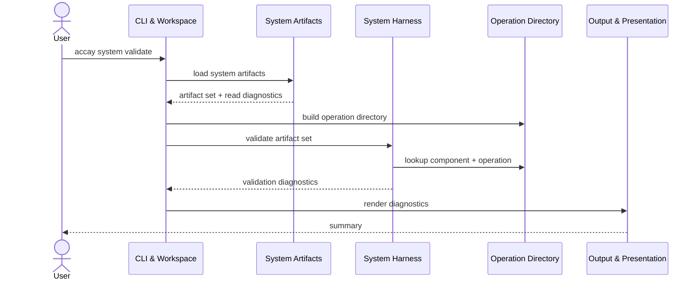
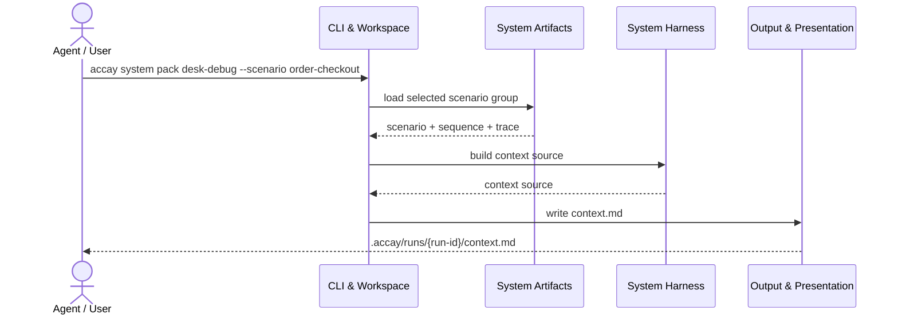

# System Artifacts 基本設計
## 1. 位置づけ
System Artifacts は、Accay MVP の system side に属する component である。
役割は、system side の正本成果物を発見し、読み取り、System Harness が扱える形へ構造化することである。
対象は、E2E に近い業務シナリオ、シナリオ説明、机上デバッグ trace である。
この component は、最終判断、意味判断、schema validation、operation 解決を行わない。
読み取り時に見つけた問題は、例外で止めるのではなく diagnostics として渡せる形にする。
## 2. 設計前提
Accay は system と component を明確に分ける。
system side はシステム全体のシナリオと operation 列を扱う。
component side は個別 component の責務、契約、受け入れケース、テスト証拠を扱う。
両者の機械的な接続点は Operation Directory に限定する。
System Artifacts は component artifact loader を呼ばない。
System Artifacts は Operation Directory を構築しない。
System Harness が、System Artifacts の出力と Operation Directory を組み合わせて検証する。
## 3. スコープ
System Artifacts の責務は以下である。
- `docs/acceptance/scenarios/` から scenario file を発見する。
- `docs/acceptance/sequences/` から sequence document を発見する。
- `docs/acceptance/traces/` から trace YAML を発見する。
- scenario ID、sequence path、trace path の対応を表現する。
- scenario file の本文と基本 metadata を読む。
- sequence document の本文と基本 metadata を読む。
- trace YAML の基本構造を読む。
- trace step の順序を維持する。
- trace step の `component` と `operation` を文字列として保持する。
- trace step の `input` / `output` / `observations` を保持する。
- 読み取り段階の問題を diagnostics として返す。
## 4. 非スコープ
System Artifacts は以下をしない。
- trace の JSON Schema validation。
- operation の存在確認。
- schema file の存在確認。
- HTTP status code の妥当性確認。
- CLI exit code の妥当性確認。
- `acceptance-scope.yaml` の読み取り。
- `test-map.yaml` の読み取り。
- `semantics.md` の意味判断。
- `interfaces/` の contract catalog 化。
- JUnit XML の読み取り。
- trace からの受け入れテスト生成。
- 正本成果物の自動修正。
## 5. 正本ファイル
System Artifacts が扱う canonical file は以下である。
```text
docs/acceptance/
  scenarios/
    {scenario}.feature
  sequences/
    {scenario}.md
  traces/
    {scenario}.trace.yaml
```
`{scenario}` は scenario ID として扱う。
`order-checkout.feature` の scenario ID は `order-checkout` である。
`order-checkout.md` は同じ scenario ID の sequence document である。
`order-checkout.trace.yaml` は同じ scenario ID の trace である。
## 6. 入出力
入力は repository root と system artifact directories である。
出力は artifact set と diagnostics である。
| 種別 | 内容 |
|---|---|
| 入力 | repository root |
| 入力 | `docs/acceptance/scenarios/` |
| 入力 | `docs/acceptance/sequences/` |
| 入力 | `docs/acceptance/traces/` |
| 出力 | scenario model |
| 出力 | sequence reference |
| 出力 | trace model |
| 出力 | scenario group |
| 出力 | read diagnostics |
出力は System Harness が validation と context pack 生成に使える粒度にする。
## 7. Canonical file の必須性
system validation では、scenario と trace が主要な検証対象である。
sequence は人間とエージェントの理解補助であり、機械処理の正本にはしない。
ただし、sequence の欠落は desk-debug context の質を下げる。
そのため、sequence 欠落も diagnostics として表現する。
| 種別 | canonical path | 必須性 |
|---|---|---|
| scenario | `docs/acceptance/scenarios/{scenario}.feature` | system validation では必須 |
| sequence | `docs/acceptance/sequences/{scenario}.md` | 推奨、欠落時は診断対象 |
| trace | `docs/acceptance/traces/{scenario}.trace.yaml` | system validation では必須 |
欠落時の severity は System Harness が command と mode に応じて決める。
## 8. Discovery rules
Discovery は repository root からの相対 path を基準にする。
scenario discovery は `docs/acceptance/scenarios/*.feature` を対象にする。
sequence discovery は `docs/acceptance/sequences/*.md` を対象にする。
trace discovery は `docs/acceptance/traces/*.trace.yaml` を対象にする。
MVP ではサブディレクトリ配下の再帰探索をしない。
隠しファイル、一時ファイル、backup file は対象外にする。
`.trace.yml` は自動的に `.trace.yaml` と読み替えない。
正本ファイル名の揺れを早期に診断するためである。
探索結果の順序は repository relative path の昇順で安定させる。
## 9. 対象外ファイル例
以下は MVP の discovery 対象外である。
```text
docs/acceptance/scenarios/.draft.feature
docs/acceptance/scenarios/order-checkout.feature.bak
docs/acceptance/traces/order-checkout.trace.yml
docs/acceptance/traces/archive/order-checkout.trace.yaml
```
対象外ファイルは原則として読み取らない。
必要なら System Harness または CLI の別診断として「似た名前のファイル」を扱う。
System Artifacts 自身は対象外ファイルの意味を推測しない。
## 10. Scenario ID rules
scenario ID はファイル名から導出する。
`docs/acceptance/scenarios/user-import.feature` の ID は `user-import` である。
`docs/acceptance/sequences/user-import.md` の ID も `user-import` である。
`docs/acceptance/traces/user-import.trace.yaml` の ID も `user-import` である。
trace YAML の top-level `scenario` が存在する場合、ファイル名由来 ID と一致することが期待される。
一致確認は System Harness の validation 対象である。
System Artifacts は、ファイル名由来 ID と YAML 内 ID の両方を保持する。
## 11. Artifact set
Artifact set は、System Artifacts の読み取り結果全体である。
最小構造は以下の考え方にする。
```text
SystemArtifactSet
  root
  scenarios
  sequences
  traces
  scenario_groups
  diagnostics
```
`scenarios` は scenario ID から scenario model への mapping である。
`sequences` は scenario ID から sequence reference への mapping である。
`traces` は scenario ID から trace model への mapping である。
`scenario_groups` は scenario ID ごとの canonical file 対応を表す。
`diagnostics` は discovery と read の問題を保持する。
内部型は dataclass でも dict でもよい。
System Harness が必要な情報を欠落なく受け取れることを優先する。
## 12. Scenario group
Scenario group は、1 つの scenario ID に紐づく system artifact の束である。
例は以下である。
```text
scenario ID: order-checkout
  scenario: docs/acceptance/scenarios/order-checkout.feature
  sequence: docs/acceptance/sequences/order-checkout.md
  trace:    docs/acceptance/traces/order-checkout.trace.yaml
```
scenario file だけがある場合も group を作る。
trace file だけがある場合も group を作る。
sequence file だけがある場合も group を作る。
欠けている file は missing として表現する。
欠落をこの段階で fatal error にしない。
## 13. Scenario model
Scenario model は Gherkin の完全な AST である必要はない。
MVP では、scenario file の本文と path と軽い metadata を保持すればよい。
| フィールド | 内容 |
|---|---|
| `id` | ファイル名から導出した scenario ID |
| `path` | repository relative path |
| `title` | 先頭の `Feature:` 行から取れる名前 |
| `raw_text` | scenario file 全文 |
| `line_count` | 行数 |
| `diagnostics` | 読み取り時の問題 |
feature 内に複数 Scenario が存在しても、MVP では file-level scenario ID を単位に扱う。
## 14. Sequence reference
Sequence document は Markdown と Mermaid などを含む説明文である。
System Artifacts は sequence を機械処理の正本にしない。
Markdown AST の詳細解析は不要である。
| フィールド | 内容 |
|---|---|
| `id` | ファイル名から導出した scenario ID |
| `path` | repository relative path |
| `raw_text` | sequence document 全文 |
| `headings` | 抽出できる見出し一覧 |
| `line_count` | 行数 |
| `diagnostics` | 読み取り時の問題 |
Mermaid block の構文検証は行わない。
## 15. Trace model
Trace model は、机上デバッグ trace YAML を構造化した model である。
trace は実行ログではなく、期待される意味の流れと観測点を表す。
| フィールド | 内容 |
|---|---|
| `id` | ファイル名から導出した scenario ID |
| `path` | repository relative path |
| `declared_scenario` | YAML 内の `scenario` |
| `steps` | trace step の配列 |
| `raw_data` | YAML load 後の生データ |
| `raw_text` | trace file 全文 |
| `diagnostics` | 読み取り時の問題 |
`raw_data` は、後続処理で情報を失わないために保持してよい。
## 16. Trace step model
Trace step は operation 列の 1 step を表す。
| フィールド | 内容 |
|---|---|
| `index` | trace 内の 0 origin 順序 |
| `id` | step ID |
| `component` | component name |
| `operation` | operation ID |
| `input` | input payload block |
| `output` | output payload block |
| `observations` | 観測点の配列 |
| `location` | file path と行番号 |
| `raw_step` | YAML load 後の step data |
`component` と `operation` は文字列として保持する。
Operation Directory への解決は System Harness が行う。
step の順序は YAML 配列の順序をそのまま維持する。
## 17. Payload block
Payload block は `input` または `output` の下に置かれる情報を表す。
標準形は以下である。
```yaml
input:
  schema_ref: docs/acceptance/components/order-api/interfaces/schemas/create-order-input.schema.json
  value:
    customerId: cus_123
```
```yaml
output:
  status: 201
  schema_ref: docs/acceptance/components/order-api/interfaces/schemas/create-order-output.schema.json
  value:
    orderId: ord_456
    status: created
```
`schema_ref` は repository root からの相対 path として扱う。
`value` は JSON 互換の YAML value として扱う。
`status` は HTTP operation で使う補助情報である。
System Artifacts は kind を知らないため、`status` や `exit_code` の妥当性を判断しない。
## 18. Trace reading
trace file は YAML として読む。
読み取り時には以下を行う。
- UTF-8 text として読む。
- YAML として parse する。
- top-level mapping であることを確認する。
- top-level `scenario` を取得する。
- top-level `steps` を取得する。
- `steps` が配列であることを確認する。
- 各 step が mapping であることを確認する。
- step の主要 field を抽出する。
- input / output block を抽出する。
- observations を配列として抽出する。
YAML parse に失敗した場合、step 抽出は行わない。
YAML parse に成功しても構造が不正な場合、抽出できる範囲で model を作る。
## 19. Trace field policy
trace の必須 field 候補は以下である。
| 位置 | field |
|---|---|
| top-level | `scenario` |
| top-level | `steps` |
| step | `id` |
| step | `component` |
| step | `operation` |
| step | `input` |
| step | `output` |
| payload | `schema_ref` |
| payload | `value` |
欠落時も可能な限り step model は作る。
欠落 field を理由に step の順序情報を失わない。
`observations` は任意 field とする。
## 20. Validation handoff
System Artifacts から System Harness へ渡すべき情報は以下である。
- 発見された scenario ID の集合。
- scenario ID ごとの canonical file 対応。
- scenario file の path と本文。
- sequence document の path と本文。
- trace file の path と top-level `scenario`。
- trace step の順序。
- trace step の `id`。
- trace step の `component`。
- trace step の `operation`。
- trace step の `input.schema_ref`。
- trace step の `input.value`。
- trace step の `output.schema_ref`。
- trace step の `output.value`。
- trace step の `output.status`。
- trace step の `observations`。
- 読み取り段階の diagnostics。
System Harness はこれを使い、operation existence、schema ref、schema validation、status code などを検証する。
## 21. Diagnostics handoff
System Artifacts は、読み取り時点で検出できる問題を diagnostics として返す。
diagnostic は少なくとも以下の情報を持つ。
| フィールド | 内容 |
|---|---|
| `code` | 安定した診断コード |
| `severity` | `info` / `warning` / `error` の候補 |
| `message` | 人間向け説明 |
| `path` | repository relative path |
| `line` | 可能なら行番号 |
| `scenario_id` | 関連 scenario ID |
| `step_id` | 関連 step ID |
| `details` | 機械処理向け補足 |
severity の最終判断は System Harness 側で上書きできる。
## 22. Diagnostic codes
MVP で想定する diagnostic code は以下である。
| code | 発生条件 |
|---|---|
| `SYS_ARTIFACT_DIR_MISSING` | system artifact directory が存在しない |
| `SYS_SCENARIO_READ_FAILED` | scenario file を読めない |
| `SYS_SEQUENCE_READ_FAILED` | sequence file を読めない |
| `SYS_TRACE_READ_FAILED` | trace file を読めない |
| `SYS_TRACE_YAML_INVALID` | trace YAML を parse できない |
| `SYS_TRACE_TOPLEVEL_INVALID` | trace top-level が mapping ではない |
| `SYS_TRACE_STEPS_MISSING` | `steps` が存在しない |
| `SYS_TRACE_STEPS_INVALID` | `steps` が配列ではない |
| `SYS_TRACE_STEP_INVALID` | step が mapping ではない |
| `SYS_TRACE_STEP_FIELD_MISSING` | step の主要 field が欠落している |
| `SYS_TRACE_PAYLOAD_INVALID` | `input` / `output` が mapping ではない |
| `SYS_ARTIFACT_GROUP_INCOMPLETE` | scenario / sequence / trace の対応が欠けている |
operation existence や schema validation の診断コードは System Harness 側に置く。
## 23. Error handling
System Artifacts は、できるだけ部分的な読み取り結果を返す。
1 file の読み取り失敗で artifact set 全体を破棄しない。
YAML parse error がある trace は、trace model を error state として保持する。
error state の trace では `steps` を空配列にしてよい。
ただし、raw text、path、parse diagnostic は保持する。
permission error、encoding error、read error は diagnostics に変換する。
MVP では UTF-8 を基本にする。
例外は component 境界の外へ漏らさず、diagnostics に変換する。
## 24. Path conventions
model に保持する path は repository root からの相対 path を基本にする。
CLI 表示や report も repository relative path を優先する。
absolute path は debug 用 details に含めてもよい。
schema_ref も repository root からの相対 path として扱う。
System Artifacts は path 文字列を正規化しすぎない。
ユーザーが書いた path と正規化後 path の両方が必要になる場合があるためである。
repository root の外側を読むことはしない。
## 25. Model boundaries
System Artifacts の model は、system artifact の読み取り結果だけを表す。
component contract の解決結果を model に混ぜない。
trace step model に `operation_kind` を入れない。
trace step model に `input_schema_resolved` を入れない。
trace step model に `acceptance_case_ids` を入れない。
System Harness が検証結果として enrichment を作る場合は、別の validation result model に置く。
## 26. Interactions
主な利用者は CLI と System Harness である。
CLI は repository root を決め、System Artifacts を呼び出す。
System Artifacts は artifact set を返す。
System Harness は artifact set と Operation Directory を受け取り、system validation を行う。
Output & Presentation は Harness の diagnostics や context source を整形する。

## 27. Desk-debug pack interaction
desk-debug context pack では、System Artifacts は対象 scenario group を提供する。
System Harness は、その group から context source を作る。
Output & Presentation は `.accay/runs/{run-id}/context.md` を書き出す。

## 28. Example: HTTP trace
```yaml
scenario: order-checkout
steps:
  - id: create-order-http
    component: order-api
    operation: createOrder
    input:
      schema_ref: docs/acceptance/components/order-api/interfaces/schemas/create-order-input.schema.json
      value:
        customerId: cus_123
        items:
          - sku: SKU-001
            quantity: 2
    output:
      status: 201
      schema_ref: docs/acceptance/components/order-api/interfaces/schemas/create-order-output.schema.json
      value:
        orderId: ord_456
        status: created
    observations:
      - customerId is preserved for payment authorization
```
## 29. Example: CLI trace
```yaml
scenario: user-import
steps:
  - id: import-users
    component: user-import-cli
    operation: importUsers
    input:
      schema_ref: docs/acceptance/components/user-import-cli/interfaces/schemas/import-users-input.schema.json
      value:
        file: users.csv
        dry_run: false
    output:
      schema_ref: docs/acceptance/components/user-import-cli/interfaces/schemas/import-users-output.schema.json
      value:
        exit_code: 0
        imported_count: 120
        skipped_count: 3
    observations:
      - invalid rows are skipped, not imported
```
## 30. Implementation notes
推奨 package は `src/accay/system/artifacts.py` である。
必要に応じて `src/accay/system/models.py` を追加してよい。
`component` package から import しない。
`operations` package から import する必要は基本的にない。
YAML parser は安全な loader を使う。
file discovery と diagnostics の出力順は deterministic にする。
大きな file でも扱えるように、読み取り関数は file ごとに独立させる。
MVP では streaming parser は不要である。
## 31. API shape の目安
具体的な関数名は実装中に調整してよい。
役割の分離は維持する。
```text
load_system_artifacts(root) -> SystemArtifactSet
discover_system_artifacts(root) -> DiscoveredSystemArtifacts
read_scenario(path, root) -> ScenarioModel
read_sequence(path, root) -> SequenceReference
read_trace(path, root) -> TraceModel
group_system_artifacts(discovered) -> list[ScenarioArtifactGroup]
```
`load_system_artifacts` は通常利用の entry point とする。
`read_trace` は YAML parse と step 抽出を担当する。
`group_system_artifacts` は scenario ID ごとの対応付けを担当する。
## 32. Test strategy
テストは、読み取り結果と diagnostics を中心に置く。
Contract Test では、fixture repository に対する CLI 経由の公開挙動を確認する。
Unit Test では、artifact discovery と trace parser の局所挙動を確認する。
主なテスト観点は以下である。
- scenario / sequence / trace が発見できること。
- scenario ID が file name から導出されること。
- scenario / sequence / trace が group 化されること。
- trace step の順序が維持されること。
- trace step id、component、operation が読み取れること。
- input / output の schema_ref と value が保持されること。
- output status が保持されること。
- observations が保持されること。
- component artifact が存在しなくても読み取り自体は成立すること。
- YAML parse error が diagnostics になること。
- `steps` 欠落が diagnostics になること。
- sequence 欠落が missing として表現されること。
- discovery order が安定していること。
schema validation と operation existence は System Harness 側のテストで扱う。
## 33. Acceptance criteria
この component の実装が満たすべき基本条件は以下である。
- system artifact directories を安全に探索できる。
- canonical file naming に従って scenario ID を導出できる。
- scenario / sequence / trace の対応を欠落込みで表現できる。
- scenario file と sequence document の raw text を保持できる。
- trace YAML を parse し、step 配列を順序通り保持できる。
- trace step の component と operation を解決せずに保持できる。
- input / output payload を schema validation せずに保持できる。
- 読み取り失敗を diagnostics として返せる。
- component side の artifact を読まない。
- System Harness が validation に必要な情報を受け取れる。
## 34. 禁止事項
System Artifacts では以下を行わない。
- `docs/acceptance/components/` を正本として読む。
- `acceptance-scope.yaml` を読む。
- `test-map.yaml` を読む。
- JUnit XML を読む。
- Operation Directory を構築する。
- trace step の operation を解決する。
- schema_ref の JSON Schema を開く。
- `semantics.md` の意味を判断する。
- trace の意味保存条件を accept / reject する。
- 正本ファイルを書き換える。
これらが必要になった場合は、別 component の責務として扱う。
## 35. 将来拡張
MVP 後に検討できる拡張は以下である。
- subdirectory を含む scenario grouping。
- `.trace.yml` の許容。
- trace payload の `value_ref` による外部 JSON / YAML 参照。
- Gherkin parser による Scenario 単位の model 化。
- Markdown AST による sequence の構造抽出。
- trace authoring support 用の skeleton 生成。
- 関連 component semantics の context pack への補助的な取り込み。
これらは基本設計の責務境界を変えない範囲で追加する。
system と component の正本を直接混ぜない方針は維持する。
